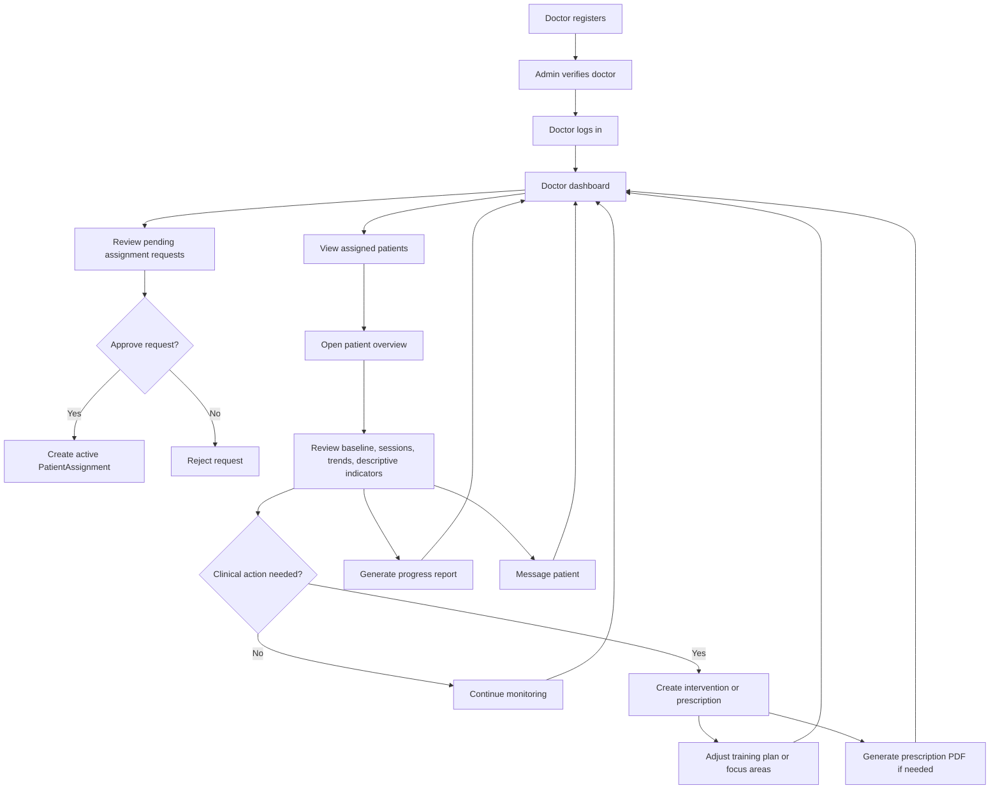
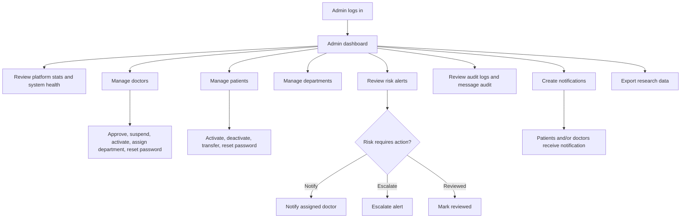
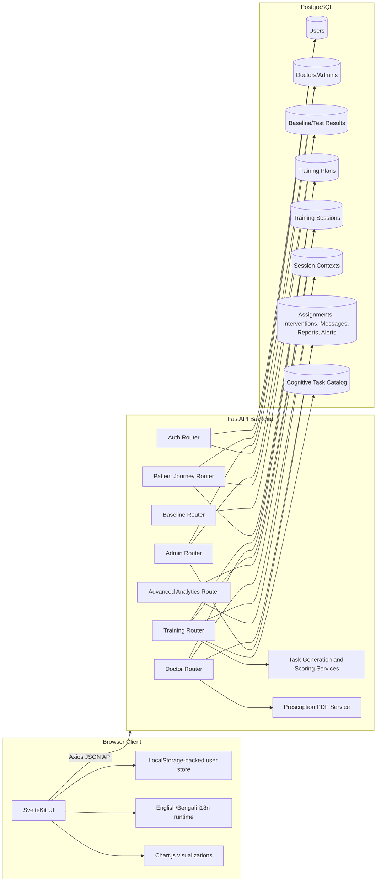
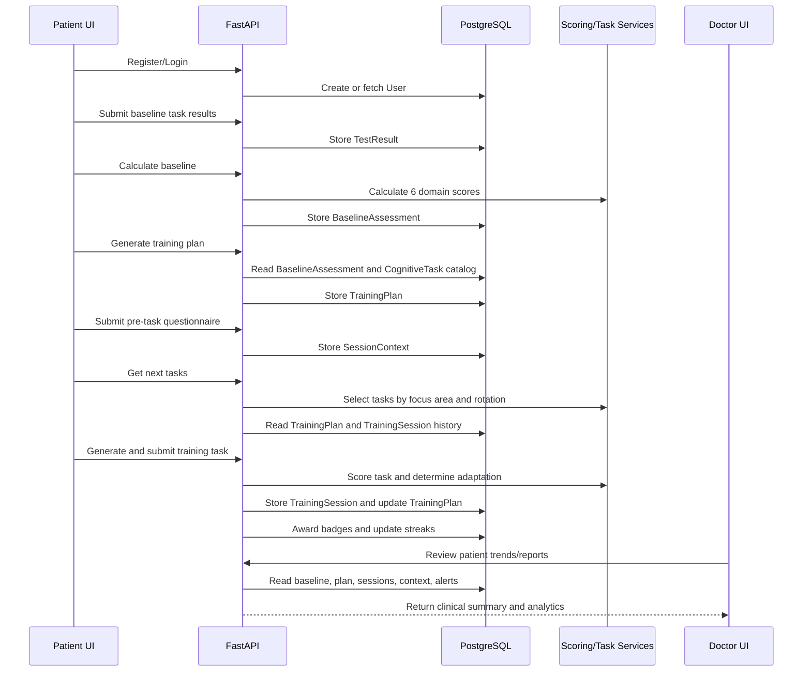
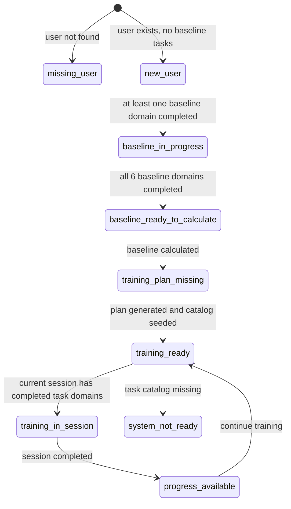

# NeuroBloom Project Information

## 1. Project Summary

NeuroBloom is a free, open-source web platform for longitudinal cognitive monitoring and clinician-guided cognitive rehabilitation in multiple sclerosis (MS). The platform supports patients, clinicians, and administrators through a complete digital care workflow: patient registration, baseline cognitive assessment, personalized adaptive training, contextual symptom capture, progress analytics, clinician monitoring, prescriptions, messaging, alerts, and administrative governance.

The project is implemented as a full-stack application:

- Frontend: SvelteKit, Svelte 5, Vite, JavaScript, Chart.js, Axios
- Backend: FastAPI, SQLModel, Pydantic Settings, PostgreSQL
- Deployment: Docker Compose with PostgreSQL, backend API, and static frontend container
- License: MIT

The deployed project referenced in the repository README is:

```text
https://neurobloom-67qo.onrender.com/
```

## 2. Project Goals

NeuroBloom is designed to:

- Provide accessible cognitive rehabilitation support for MS patients.
- Track cognitive performance longitudinally between formal clinical visits.
- Capture contextual factors that influence cognitive performance, such as fatigue, sleep, pain, stress, medication timing, distractions, and time of day.
- Generate personalized training plans from baseline cognitive assessment data.
- Adapt task difficulty using ongoing performance.
- Support clinicians with dashboards, patient trends, reports, interventions, prescriptions, alerts, and secure messaging.
- Support administrators with doctor approval, department management, patient oversight, audit logs, notifications, risk escalation, system health, and research data export.
- Provide bilingual user interface support for English and Bengali.

## 3. User Roles

### Patient

Patients use NeuroBloom to:

- Register and log in.
- Complete a 6-domain baseline cognitive assessment.
- Generate or receive a personalized training plan.
- Complete adaptive cognitive training tasks.
- Complete a pre-task questionnaire before sessions.
- View dashboard summaries, progress, history, domain performance, insights, achievements, badges, prescriptions, notifications, messages, settings, and profile information.
- Consent to share data with doctors.
- Find available doctors and request assignment.
- Exchange secure messages with assigned clinicians.

### Doctor / Clinician

Doctors use NeuroBloom to:

- Register and log in through doctor authentication.
- Await admin verification before full activation.
- View assigned patient lists.
- Review patient overview, trends, sessions, progress monitoring, and detailed reports.
- Create interventions and training recommendations.
- Adjust patient training plans and focus areas.
- Create, update, retire, and export prescriptions as PDFs.
- Generate weekly or monthly progress reports.
- Exchange secure messages with patients.
- View notifications and analytics.
- Approve or reject patient assignment requests.

### Administrator

Administrators use NeuroBloom to:

- Log in through the admin portal.
- View platform statistics and system health.
- Manage doctors, doctor verification, suspension, activation, departments, and doctor department assignment.
- Manage patients, patient activation, deactivation, transfers, and password resets.
- Review configurable attention-required flags.
- Notify doctors, escalate alerts, and mark risk alerts reviewed.
- Review interventions and message audit records.
- Create platform-wide notifications.
- Review audit logs.
- Access research export summaries and download research-oriented data.

## 4. Main Feature Inventory

### Authentication and Accounts

- Patient registration and login.
- Doctor registration and login.
- Admin login.
- Password hashing through backend security utilities.
- Patient profile fields: email, full name, date of birth, diagnosis, consent to share, active status.
- Doctor profile fields: email, full name, license number, specialization, institution, department, active status, verification status, created date, last login.
- Admin-managed doctor verification and account activation states.

### Baseline Assessment

The baseline assessment requires all 6 cognitive domains:

- Working memory
- Attention
- Flexibility
- Planning
- Processing speed
- Visual scanning

Baseline scores are calculated from submitted task results. Each domain receives a 0-100 score, and the overall score is the average of completed domain scores. The backend requires all 6 baseline tasks before a real baseline can be calculated.

Baseline data stored:

- User ID
- Assessment date
- Domain scores
- Overall score
- Raw metrics JSON
- Baseline flag
- Assessment duration

### Personalized Training Plan

After baseline calculation, the training plan generator:

- Reads the latest real baseline assessment.
- Sorts domain scores.
- Assigns weaker domains to primary focus.
- Assigns middle domains to secondary focus.
- Assigns stronger domains to maintenance.
- Selects recommended tasks by domain.
- Maps baseline score to initial difficulty level from 1 to 10.
- Stores current difficulty by domain.
- Tracks session pacing, streaks, session number, completed task domains, and progress.

Default training plan pacing:

- Maximum sessions per day: 3
- Recommended sessions per week: 7
- Tasks per session: 4
- Recommended session length: 5-10 minutes
- Cooldown between sessions: 30 minutes

Difficulty mapping:

- Score below 50: low starting difficulty, usually level 1-2
- Score 50-70: moderate starting difficulty, usually level 3-5
- Score 70-85: higher starting difficulty, usually level 6-8
- Score above 85: advanced starting difficulty, usually level 9-10

### Adaptive Training

Training sessions store:

- User ID
- Training plan ID
- Cognitive domain
- Task type
- Task code
- Score
- Accuracy
- Average reaction time
- Consistency
- Error count
- Difficulty before and after
- Duration
- Raw trial-level data
- Adaptation reason
- Completion state

The general difficulty adaptation rule is:

- Accuracy >= 85 percent: increase difficulty by 1, capped at 10.
- Accuracy < 65 percent: decrease difficulty by 1, floored at 1.
- Accuracy 65-85 percent: maintain difficulty.

Some specialized tasks implement task-specific thresholds or scoring rules, but the overall platform behavior is adaptive, performance-driven training.

### Task Rotation

The backend seeds a cognitive task catalog and uses a rotation service to reduce repetition while preserving domain coverage.

Rotation strategies:

- Working memory: sequential, avoid recent repetitions.
- Processing speed: weighted, with higher priority for clinically important tasks such as SDMT.
- Attention: random, avoid recent repetitions.
- Flexibility: adaptive, emphasizes tasks where the patient has weaker performance.
- Planning: balanced, encourages equal exposure.
- Visual scanning: difficulty matched, avoids recent repetitions.

User task preferences can be stored as favorite, neutral, or dislike and influence weighted selection.

### Pre-Task Context Questionnaire

Before training, the platform can capture contextual factors:

- Fatigue level, 1-10
- Sleep quality, 1-10
- Sleep hours
- Medication taken today
- Hours since last medication
- Pain level, 1-10
- Stress level, 1-10
- Time of day
- Readiness level, 1-10
- Notes
- Distractions present
- Location

This context can be linked to training sessions and used in analytics.

### Descriptive Longitudinal Analytics

The analytics module computes descriptive monitoring indicators that may support future digital-biomarker-oriented research. These indicators are not clinically or psychometrically validated as diagnostic, prognostic, or treatment-response biomarkers:

- Fatigue signature detection through within-session performance decline.
- Accuracy decline between early and late trials.
- Reaction time increase within a session.
- Performance slope.
- Intra-individual variability metrics such as reaction time standard deviation, coefficient of variation, median absolute deviation, interquartile range, and range.
- Across-session variability.
- Reliable change index.
- EWMA trend detection for score and reaction time.
- Contextual correlations with fatigue, sleep quality, and medication timing.

### Progress and Gamification

Patient progress features include:

- Training history.
- Performance metrics.
- Baseline versus current comparison.
- Performance trends.
- Weekly summary.
- Domain progress.
- Insights.
- Achievements.
- Badges.
- Streak tracking.

Badge categories include:

- Session count milestones.
- Streak milestones.
- Performance milestones.
- Difficulty milestones.
- Domain diversity.
- Domain expertise.
- Large improvement.

### Doctor Portal

Doctor-facing features include:

- Dashboard.
- Patient list.
- Patient detail page.
- Patient trends.
- Patient sessions.
- Progress monitoring.
- Interventions.
- Prescriptions.
- Prescription PDF export.
- Patient reports.
- Doctor analytics.
- Doctor messages.
- Doctor notifications.
- Assignment request handling.

### Admin Portal

Admin-facing features include:

- Dashboard and platform statistics.
- Risk alerts.
- Doctor management.
- Department management.
- Patient management.
- Interventions review.
- Messages audit.
- Audit logs.
- System health.
- Notifications.
- Research export summary and download.

### Communication and Notifications

The platform supports:

- Patient-to-doctor messages.
- Doctor-to-patient messages.
- Read status tracking.
- Message threading field for future expansion.
- Patient notifications.
- Doctor notifications.
- Admin-created platform notifications.
- Announcement, feature update, and research invitation notification types.

### Prescriptions and Reports

Doctors can create structured prescription interventions. Prescription data supports:

- Title
- Summary
- Patient instructions
- Clinician notes
- Medication list
- Lifestyle plan
- Validity dates
- Review date
- Follow-up plan
- Status
- Verification ID
- Versioning
- PDF export with digital signature block

Reports support:

- Patient ID
- Doctor ID
- Weekly or monthly period
- Start and end dates
- Aggregated report data JSON
- Doctor commentary
- Generation and update timestamps

### Localization

The frontend includes English and Bengali support through:

- Runtime locale store.
- Route localization helpers.
- Translation catalogs.
- Patient copy helpers.
- Task translation files.
- Localization audit scripts.

The landing page, patient interface, and UI copy are structured to support both languages.

## 5. Cognitive Task Catalog

The seeded catalog contains 35 original tasks across 6 domains. The complete auditable inventory is in `docs/task_inventory.csv`, including provenance, scoring, adaptation, licensing, software paths, and verification status. Paradigm inspiration does not imply equivalence to a named standardized instrument or clinical validation.

| Domain | Task Code | Task Name | Baseline Task | Main Purpose |
|---|---|---:|---:|---|
| Working memory | n_back | N-Back Test | Yes | Working memory updating |
| Working memory | digit_span | Digit Span | No | Verbal short-term and working memory |
| Working memory | spatial_span | Spatial Span / Corsi Block | No | Visuospatial working memory |
| Working memory | letter_number_sequencing | Letter-Number Sequencing | No | Working memory manipulation |
| Working memory | operation_span | Operation Span | No | Dual-task working memory capacity |
| Working memory | dual_n_back | Dual N-Back | No | Visual and auditory working memory |
| Processing speed | simple_reaction | Simple Reaction Time | Yes | Basic response speed |
| Processing speed | sdmt | Symbol Digit Modalities Test | No | MS-sensitive processing speed |
| Processing speed | trails_a | Trail Making Test Part A | No | Psychomotor speed |
| Processing speed | pattern_comparison | Pattern Comparison | No | Perceptual comparison speed |
| Processing speed | inspection_time | Inspection Time | No | Perceptual speed without major motor confound |
| Processing speed | choice_reaction_time | Choice Reaction Time | No | Decision speed |
| Attention | cpt | Continuous Performance Test | Yes | Sustained attention |
| Attention | pasat | PASAT | No | Sustained attention and working memory |
| Attention | stroop | Stroop Color-Word Test | No | Selective attention and inhibition |
| Attention | go_nogo | Go/No-Go | No | Response inhibition |
| Attention | flanker | Flanker Task | No | Interference control |
| Attention | sart | Sustained Attention to Response Task | No | Vigilance and lapses |
| Flexibility | task_switching | Task Switching | Yes | Rule switching |
| Flexibility | trails_b | Trail Making Test Part B | No | Set shifting |
| Flexibility | wcst | Wisconsin Card Sorting Test | No | Cognitive flexibility |
| Flexibility | dccs | Dimensional Change Card Sort | No | Dimension switching |
| Flexibility | rule_shift | Rule Shift | No | Rule maintenance and adaptation |
| Flexibility | plus_minus | Plus-Minus Task | No | Switching cost |
| Planning | tower_of_london | Tower of London | Yes | Executive planning |
| Planning | stockings_cambridge | Stockings of Cambridge | No | Planning and problem solving |
| Planning | verbal_fluency | Verbal Fluency | No | Executive retrieval strategy |
| Planning | category_fluency | Category Fluency | No | Semantic retrieval |
| Planning | twenty_questions | Twenty Questions | No | Strategic problem solving |
| Visual scanning | visual_search | Visual Search | Yes | Target search |
| Visual scanning | cancellation_test | Cancellation Test | No | Visual scanning and attention |
| Visual scanning | feature_conjunction | Feature vs Conjunction Search | No | Feature/conjunction search |
| Visual scanning | landmark_task | Landmark Task | No | Spatial attention and bias |
| Visual scanning | multiple_object_tracking | Multiple Object Tracking | No | Dynamic visual attention |
| Visual scanning | useful_field_of_view | Useful Field of View | No | Central and peripheral visual attention |

All catalog tasks have difficulty range 1-10.

## 6. Frontend Structure

The SvelteKit frontend lives in:

```text
frontend-svelte/
```

Important files and folders:

```text
frontend-svelte/src/routes/              Route-based pages
frontend-svelte/src/lib/api.js           Axios API client
frontend-svelte/src/lib/stores.js        User/auth store backed by localStorage
frontend-svelte/src/lib/task-registry.js Task key to training route mapping
frontend-svelte/src/lib/i18n/            Localization runtime and catalogs
frontend-svelte/src/lib/components/      Shared UI components
frontend-svelte/src/lib/dashboard/       Patient dashboard helpers
frontend-svelte/src/lib/task-practice/   Practice mode profiles
frontend-svelte/static/                  Static assets
frontend-svelte/images/logo.png          Logo used by frontend and PDF generation
```

Key patient routes:

```text
/
/login
/register
/dashboard
/baseline
/baseline/results
/baseline/tasks/{domain}
/training
/training/{task}
/progress
/progress/history
/progress/domains
/progress/insights
/progress/achievements
/session-summary
/messages
/notifications
/prescriptions
/profile
/settings
/find-doctor
```

Key doctor routes:

```text
/doctor/dashboard
/doctor/patients
/doctor/patient/[id]
/doctor/patient/[id]/prescriptions
/doctor/patient/[id]/reports
/doctor/analytics
/doctor/messages
/doctor/notifications
/doctor/prescriptions
/doctor/reports
```

Key admin routes:

```text
/admin/dashboard
/admin/analytics
/admin/audit-logs
/admin/departments
/admin/doctors
/admin/interventions
/admin/messages
/admin/notifications
/admin/patients
/admin/research-data
/admin/system-health
```

## 7. Backend Structure

The backend lives in:

```text
backend/
```

Important files and folders:

```text
backend/app/main.py                    FastAPI app, middleware, router registration
backend/app/core/config.py             Environment loading, database engine, DB init
backend/app/core/scoring.py            Baseline domain scoring
backend/app/core/advanced_analytics.py Descriptive indicator and longitudinal analytics
backend/app/core/prescriptions.py      Prescription serialization and PDF generation
backend/app/api/                       API routers
backend/app/models/                    SQLModel database models
backend/app/schemas/                   Pydantic/SQLModel schemas
backend/app/services/                  Cognitive task services and support services
backend/seed_cognitive_tasks.py        Cognitive task catalog seeding
backend/seed_initial_data.py           Initial setup data
backend/tests/                         Backend tests
```

Registered backend route groups:

```text
/api/auth
/api/patient-journey
/api/tasks
/api/baseline
/api/training
/api/doctor
/api/admin
/api/training/advanced-analytics
```

The root endpoint returns:

```text
NeuroBloom - MS Cognitive Training & Research Platform
```

## 8. Database Model Overview

Main tables:

| Model | Purpose |
|---|---|
| User | Patient account and profile |
| Doctor | Clinician account and verification status |
| Admin | Administrator account |
| Department | Clinical department grouping |
| AssignmentRequest | Patient-doctor assignment request workflow |
| PatientAssignment | Active and historical doctor-patient links |
| TestResult | Baseline task result storage |
| BaselineAssessment | Calculated 6-domain baseline profile |
| CognitiveTask | Seeded task catalog |
| UserTaskPreference | Patient preference for task variants |
| TrainingPlan | Personalized plan, focus areas, difficulty, pacing, streaks |
| TrainingSession | Individual task/session performance record |
| SessionContext | Pre-task questionnaire and contextual factors |
| UserBadge | Earned patient badges |
| RiskAlert | High-risk patient alert state |
| DoctorIntervention | Doctor recommendations, notes, prescriptions, interventions |
| Message | Secure doctor-patient messages |
| Notification | Admin-created platform notifications |
| ProgressReport | Weekly/monthly patient progress report |
| AuditLog | Administrative and governance audit trail |

## 9. API Surface Summary

### Auth API

```text
POST  /api/auth/register
POST  /api/auth/login
POST  /api/auth/doctor/register
POST  /api/auth/doctor/login
PATCH /api/auth/patient/{patient_id}/consent
GET   /api/auth/patient/{patient_id}/profile
PATCH /api/auth/patient/{patient_id}/profile
GET   /api/auth/patient/{patient_id}/messages
POST  /api/auth/patient/{patient_id}/messages/send
GET   /api/auth/patient/{patient_id}/messages/with-doctor
POST  /api/auth/patient/{patient_id}/messages/{message_id}/mark-read
GET   /api/auth/patient/{patient_id}/notifications
GET   /api/auth/patient/{patient_id}/prescriptions
GET   /api/auth/patient/{patient_id}/prescriptions/{prescription_id}/pdf
```

### Baseline and Patient Journey API

```text
GET  /api/patient-journey/{user_id}
POST /api/baseline/calculate
GET  /api/baseline/{user_id}
GET  /api/tasks/results/{user_id}/baseline-status
POST /api/tasks/results
GET  /api/tasks/results/{user_id}
GET  /api/tasks/results/{user_id}/stats
```

### Training API

```text
POST /api/training/training-plan/generate/{user_id}
GET  /api/training/training-plan/{user_id}
GET  /api/training/training-plan/{user_id}/next-tasks
GET  /api/training/training-plan/{user_id}/streak
POST /api/training/training-session/submit
GET  /api/training/training-session/history/{user_id}
GET  /api/training/training-session/metrics/{user_id}
GET  /api/training/training-session/performance-comparison/{user_id}
GET  /api/training/trends/{user_id}
GET  /api/training/weekly-summary/{user_id}
GET  /api/training/badges/{user_id}
GET  /api/training/badges/available/{user_id}
GET  /api/training/badges/recent/{user_id}
```

### Advanced Analytics API

```text
POST  /api/training/session-context
GET   /api/training/session-context/{user_id}/recent
PATCH /api/training/training-session/{session_id}/link-context
GET   /api/training/advanced-analytics/{user_id}/session/{session_id}
GET   /api/training/advanced-analytics/{user_id}/longitudinal
GET   /api/training/advanced-analytics/{user_id}/biomarkers
```

### Doctor API

```text
GET   /api/doctor/{doctor_id}/patients
POST  /api/doctor/{doctor_id}/assign-patient
GET   /api/doctor/{doctor_id}/patient/{patient_id}/overview
GET   /api/doctor/{doctor_id}/patient/{patient_id}/trends
GET   /api/doctor/{doctor_id}/patient/{patient_id}/sessions
GET   /api/doctor/{doctor_id}/patient/{patient_id}/progress-monitoring
POST  /api/doctor/{doctor_id}/patient/{patient_id}/intervention
GET   /api/doctor/{doctor_id}/patient/{patient_id}/interventions
PATCH /api/doctor/{doctor_id}/patient/{patient_id}/training-plan
PATCH /api/doctor/{doctor_id}/patient/{patient_id}/focus-areas
GET   /api/doctor/{doctor_id}/prescriptions
GET   /api/doctor/{doctor_id}/patient/{patient_id}/prescriptions
POST  /api/doctor/{doctor_id}/patient/{patient_id}/prescriptions
PUT   /api/doctor/{doctor_id}/patient/{patient_id}/prescriptions/{prescription_id}
PATCH /api/doctor/{doctor_id}/patient/{patient_id}/prescriptions/{prescription_id}/status
GET   /api/doctor/{doctor_id}/patient/{patient_id}/prescriptions/{prescription_id}/pdf
POST  /api/doctor/{doctor_id}/messages/send
GET   /api/doctor/{doctor_id}/messages
GET   /api/doctor/{doctor_id}/messages/conversation/{patient_id}
POST  /api/doctor/{doctor_id}/messages/{message_id}/mark-read
GET   /api/doctor/{doctor_id}/notifications
POST  /api/doctor/{doctor_id}/patients/{patient_id}/generate-report
GET   /api/doctor/{doctor_id}/patients/{patient_id}/reports
PATCH /api/doctor/{doctor_id}/reports/{report_id}/commentary
GET   /api/doctor/{doctor_id}/analytics
GET   /api/doctor/{doctor_id}/analytics/domains
GET   /api/doctor/{doctor_id}/analytics/trends
```

### Assignment API

```text
GET  /api/doctor/patient/{patient_id}/assigned-doctor
GET  /api/doctor/available-doctors
POST /api/doctor/request-assignment
GET  /api/doctor/{doctor_id}/pending-requests
POST /api/doctor/request/{request_id}/approve
POST /api/doctor/request/{request_id}/reject
GET  /api/doctor/patient/{patient_id}/requests
POST /api/doctor/{doctor_id}/unassign/{patient_id}
```

### Admin API

```text
POST  /api/admin/login
GET   /api/admin/stats
GET   /api/admin/risk-alerts
POST  /api/admin/risk-alerts/{patient_id}/notify-doctor
POST  /api/admin/risk-alerts/{patient_id}/escalate
POST  /api/admin/risk-alerts/{patient_id}/mark-reviewed
GET   /api/admin/doctors
PATCH /api/admin/doctors/{doctor_id}/department
PATCH /api/admin/doctors/{doctor_id}/approve
PATCH /api/admin/doctors/{doctor_id}/suspend
PATCH /api/admin/doctors/{doctor_id}/activate
POST  /api/admin/doctors/{doctor_id}/reset-password
GET   /api/admin/departments
POST  /api/admin/departments
GET   /api/admin/patients
PATCH /api/admin/patients/{patient_id}/deactivate
PATCH /api/admin/patients/{patient_id}/activate
POST  /api/admin/patients/{patient_id}/reset-password
POST  /api/admin/patients/{patient_id}/transfer
GET   /api/admin/patients/{patient_id}/overview
GET   /api/admin/interventions
GET   /api/admin/messages/audit
GET   /api/admin/audit-logs
GET   /api/admin/system-health
GET   /api/admin/notifications
POST  /api/admin/notifications
GET   /api/admin/research-exports/summary
GET   /api/admin/research-exports/download
```

## 10. End-to-End Patient Workflow

```mermaid
flowchart TD
    A[Patient opens NeuroBloom] --> B{Has account?}
    B -- No --> C[Register patient account]
    B -- Yes --> D[Login]
    C --> D
    D --> E[Patient dashboard asks backend for journey state]
    E --> F{Baseline complete?}
    F -- No --> G[Complete 6 baseline domain tasks]
    G --> H[Submit TestResult records]
    H --> I{All 6 domains complete?}
    I -- No --> G
    I -- Yes --> J[Calculate BaselineAssessment]
    F -- Yes --> K{Training plan exists?}
    J --> K
    K -- No --> L[Generate personalized TrainingPlan]
    K -- Yes --> M[Open training]
    L --> M
    M --> N[Create pre-task SessionContext]
    N --> O[Get next recommended tasks]
    O --> P[Launch selected cognitive task route]
    P --> Q[Generate task trial/session]
    Q --> R[Patient completes task]
    R --> S[Submit training result]
    S --> T[Store TrainingSession and raw data]
    T --> U[Link SessionContext to TrainingSession]
    U --> V[Update difficulty, streaks, badges, plan progress]
    V --> W[Update dashboard, progress, trends, weekly summary]
    W --> X{Continue training?}
    X -- Yes --> M
    X -- No --> Y[Review progress, messages, prescriptions, notifications]
```



## 11. Doctor Workflow



## 12. Admin Workflow



## 13. System Architecture Diagram



## 14. Data Flow Diagram



## 15. Patient Journey State Machine

The patient journey service determines the next route and action label from the user's database state.



## 16. Deployment and Runtime

### Local Development

Backend:

```bash
cd backend
python -m venv .venv
.venv\Scripts\activate
pip install -r requirements.txt
python seed_initial_data.py
uvicorn app.main:app --reload --host 127.0.0.1 --port 8000
```

Frontend:

```bash
cd frontend-svelte
npm install
npm run dev
```

Local URLs:

```text
Frontend: http://localhost:5174
Backend:  http://127.0.0.1:8000
```

### Docker Compose

Docker Compose starts:

- PostgreSQL 16 Alpine
- FastAPI backend on port 8000
- Frontend static container on port 8080

Command:

```bash
docker compose --env-file .env.local -f compose.yaml up --build
```

After containers start, seed data once:

```bash
docker compose --env-file .env.local -f compose.yaml exec backend python seed_initial_data.py
```

Docker URLs:

```text
Frontend: http://localhost:8080
Backend:  http://localhost:8000
```

### Environment Variables

Important environment variables:

```text
POSTGRES_DB
POSTGRES_USER
POSTGRES_PASSWORD
POSTGRES_HOST
POSTGRES_PORT
DATABASE_URL
CORS_ALLOWED_ORIGINS
API_BASE_URL
SQL_ECHO
DB_STARTUP_MAX_ATTEMPTS
DB_STARTUP_RETRY_SECONDS
VITE_API_BASE_URL
```

The backend loads environment values from:

```text
.env.local
.env
backend/.env
```

## 17. Testing and Validation Assets

Backend test and verification files include:

- Auth tests
- Doctor tests
- Cognitive task tests
- Assignment verification scripts
- Weekly data verification scripts
- Descriptive longitudinal indicator tests
- Task-specific test files for SART, rule shift, visual search, dual n-back, cancellation, category fluency, PASAT, SDMT, and others

Frontend test and audit assets include:

- Vitest tests for baseline flow, progress, and task navigation.
- Bengali UI audit script.
- Locale integrity audit script.
- Patient i18n audit script.
- Localization verification report generator.

Useful commands:

```bash
cd frontend-svelte
npm run test
npm run build
npm run audit:bangla-ui
npm run audit:locale-integrity
npm run audit:patient-i18n
```

Backend:

```bash
cd backend
pytest
```

## 18. Suggested Diagram Set for Presentation or Paper

For a complete project workflow diagram package, create these diagrams from this markdown:

1. Overall system architecture.
2. Patient end-to-end workflow.
3. Baseline-to-training data pipeline.
4. Doctor monitoring and intervention workflow.
5. Admin governance workflow.
6. Database entity relationship diagram.
7. Cognitive task domain map.
8. Descriptive longitudinal indicator pipeline.

## 19. Key Implementation Notes

- The backend initializes database tables with SQLModel on startup.
- Reference cognitive tasks are seeded automatically through initialization helpers.
- CORS is configured from environment settings and supports local Vite and Docker frontend origins.
- The frontend API client uses `VITE_API_BASE_URL`.
- The frontend stores the current user in localStorage through a Svelte writable store.
- The patient journey endpoint is the central workflow gatekeeper for deciding whether the patient should continue baseline, calculate baseline, generate a plan, start training, continue a session, or view progress.
- Training plans store JSON fields for focus areas, recommended tasks, initial difficulty, current difficulty, and current session task completion.
- Training session raw data is stored as JSON for detailed analytics and future research export.
- Pre-task context is separate from the training session first, then linked to a session when the training result is submitted.
- Prescriptions are represented as structured doctor interventions and can be serialized to PDF.
- Admin notification records are platform-wide and audience-targeted.

## 20. High-Level Value Proposition

NeuroBloom combines cognitive rehabilitation, MS-specific monitoring, clinician oversight, and research-ready longitudinal data capture in one modular platform. Its strongest technical features are the 35-task adaptive cognitive training system, 6-domain baseline assessment, contextual questionnaire linkage, descriptive longitudinal analytics for future digital-biomarker-oriented research, multi-role clinical workflow, bilingual UI support, and Docker-based reproducible deployment.
